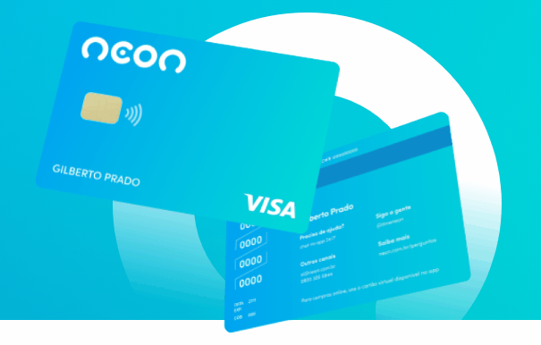
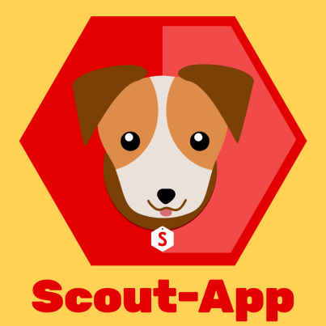
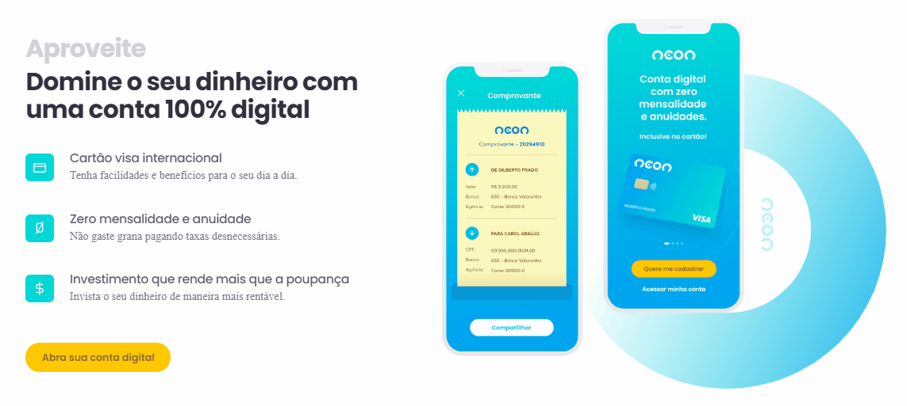

<h1>Landing Page NEON</h1>

<h2>Neste projeto o objetivo foi fazer um redesign da landing page do banco NEON. Além disso, utilizando o <a href="https://app.netlify.com/teams/ig0rfranca/overview">Netlify</a>, foi possível deixar este projeto totalmente online! <a href="https://app.netlify.com">CLIQUE AQUI E CONFIRA</a></h2>
 
<h3>Tecnologias utilizadas:</h3>
<ul>
    <li>HTML</li>
    <li>
        <a href="#css">
            CSS...
        </a>
    </li>
    <li>
        <a href="#sass">
            SASS...
        </>
    </li>
    <li>
        <a href="#js">
            JavaScript...
        </a>
    </li>
</ul>

 
<h3 id="css" >CSS:</h3>

    Para fazer as animações dos cartões na primeira seção, utilizei <a href="https://developer.mozilla.org/pt-BR/docs/Web/CSS/CSS_Animations/Using_CSS_animations">keyframes</a>.
    

        
    

 
<h3 id="sass" >SASS:</h3>

    Como compilador de SASS --> CSS, utilizei o <a href="https://scout-app.io/">Scout-App</a>.
    

        
    

 
<h3 id="js" >JavaScript:</h3>

    Para fazer o carrosel de comentários, utilizei o <a href="https://swiperjs.com/demos">Swiperjs</a>.
    

        
    

 

    E para fazer as animações das seções quando acessamos pela primeira vez o site, utilizei o <a href="https://michalsnik.github.io/aos/">AOS Animate</a>.
    

        
    

 

    <strong>by <a>Igor R.F.</a></strong>

